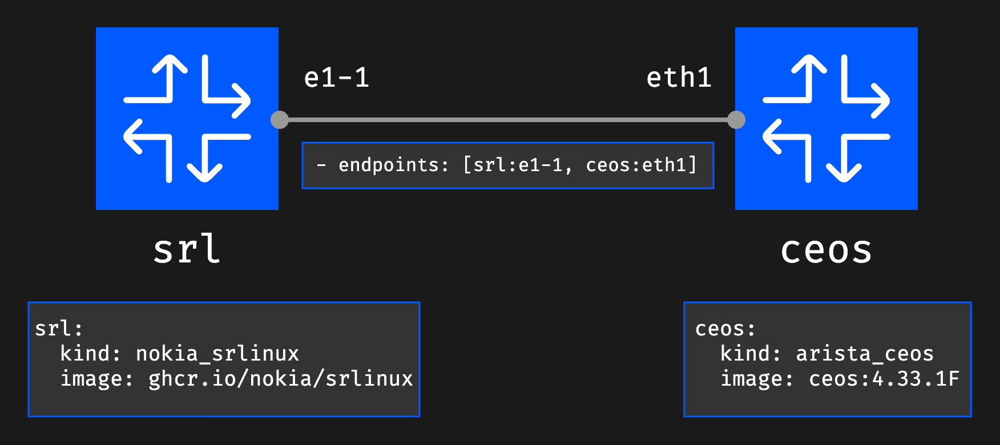
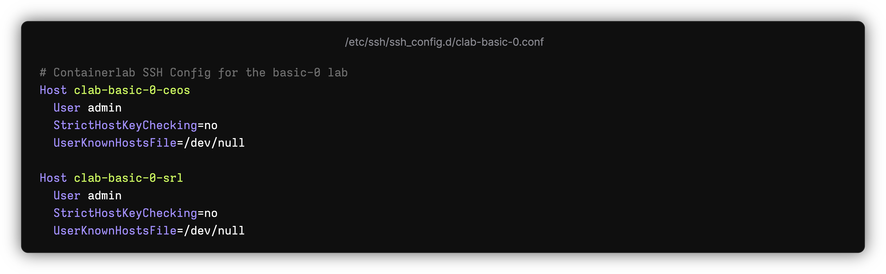
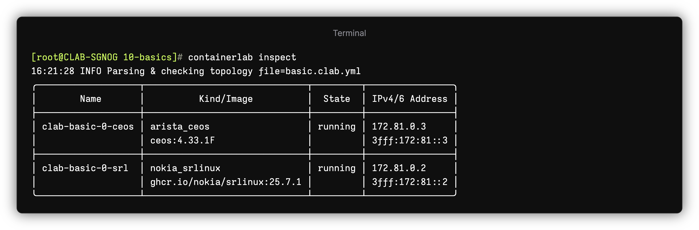
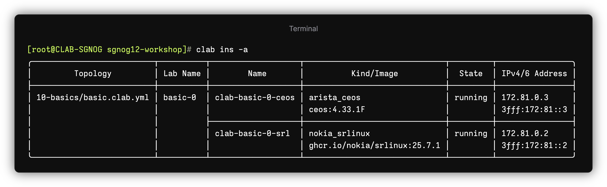
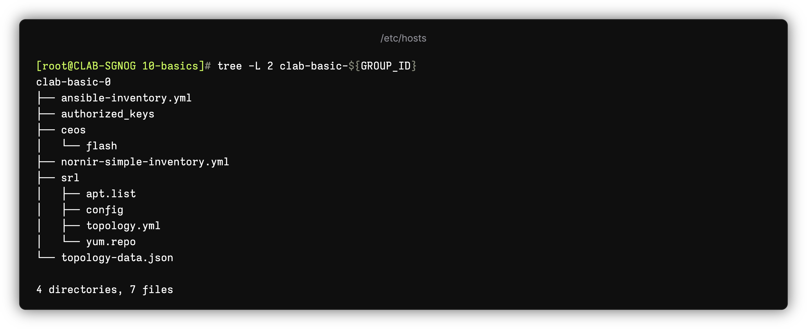

# Containerlab Basics

This workshop section introduces you to containerlab basics.

- Topology YAML file
- Image management workflow
- The lifecycle of a lab.

## Repository

The repo should be cloned already and you should navigate to the `sgnog12-workshop` directory if you are not there already.

```
[*]─[clab]─[~/sgnog12-workshop/10-basics]
└──>
```

## Topology

In Containerlab, the lab is defined via the 'topology file'. Which is a YAML file which defines the nodes and links in your desired topology.

The topology file `basic.clab.yml` defines the lab we are going to use in this basics exercise. It consists of the two nodes:

* Nokia SR Linux
* Arista cEOS

The nodes are interconnected with a single link over their respective `e1-1` and `eth1` interfaces.

```yaml
name: basic
topology:
  nodes:
    srl:
      kind: nokia_srlinux
      image: ghcr.io/nokia/srlinux:latest
    ceos:
      kind: arista_ceos
      image: ceos:4.33.1F

  links:
    - endpoints: [srl:e1-1, ceos:eth1]
```



## Deployment

Try to deploy the lab:

```bash
containerlab deploy -t basic.clab.yml
```

!!! tip
  If your topology file ends with the `.clab.yaml` or `.clab.yml` file extension **AND** is the only topology in your current directory, you don't need to specify the `-t` flag. Containerlab will search for local topologies when deploying.

Note, you can use a shorter version of the same command - `clab dep -t basic.clab.yml`.

The deployment should succeed, and you should see the following tabular output.


## Connecting to the nodes

Connect to the Nokia SR Linux node using the container name:

```bash
ssh clab-basic-${GROUP_ID}-srl
```

Connect to the cEOS node using its IP address (note, the IP might be different in your lab):

```bash
ssh admin@172.20.20.3
```

## Hostname QoL additions

Containerlab adds some quality-of-life improvements, such as automatically creating `/etc/hosts` entries for each deployed lab node. This means you can use the node hostname rather than IP address to connect.

```bash
cat /etc/hosts
```

Notice the entries added for the lab

To add to that there is also SSH host configuration created at the `/etc/ssh/ssh_config.d` dir, as `clab-{lab name}.conf`.

This means you don't have to enter username for the node with your `ssh` command. 

```bash
cat /etc/ssh/ssh_config.d/clab-basic-${GROUP_ID}.conf
```

The known hosts file for the node entry is also set to `/dev/null` for the lab nodes. This is because every time a node is booted, the host key gets regenerated. With this `/dev/null` binding, you don't need to keep clearing the `known_hosts` file on subsequent deployments of your lab.



## Checking network connectivity

In this topology SR Linux and cEOS are connected to eachother on their first ethernet interface(s). Let's confirm the connectivity between the nodes.

The nodes come with LLDP already enabled, our goal is to verify that the basic network connectivity is working between the nodes.

SSH to the SR Linux node:

```bash
ssh clab-basic-${GROUP_ID}-srl
```

and check the LLDP neighbors on ethernet-1/1 interface with the below command:

```
show /system lldp neighbor interface ethernet-1/1
```

We should see the ceos node detected as our LLDP neighbor as per the sample output below:

```
--{ running }--[  ]--
A:admin@srl# show /system lldp neighbor interface ethernet-1/1
  +--------------+----------------+----------------+----------------+----------------+----------------+---------------+
  |     Name     |    Neighbor    |    Neighbor    |    Neighbor    | Neighbor First | Neighbor Last  | Neighbor Port |
  |              |                |  System Name   |   Chassis ID   |    Message     |     Update     |               |
  +==============+================+================+================+================+================+===============+
  | ethernet-1/1 | 00:1C:73:2B:8E | ceos           | 00:1C:73:2B:8E | 8 minutes ago  | 3 seconds ago  | Ethernet1     |
  |              | :E7            |                | :E7            |                |                |               |
  +--------------+----------------+----------------+----------------+----------------+----------------+---------------+
```

## Listing running labs

When you are in the directory that contains the lab file, you can list the nodes of that lab simply by using the `containerlab inspect` command.



If the topology file is located in a different directory, you can specify the directory the topology file lives in, or if multiple topology files live in that directory, give the absolute path to the topology file:

```bash
[*]─[clab]─[/tmp]
└──> containerlab inspect -t ~/sgnog12-workshop/10-basics
```

You can also list all running labs regardless of where their topology files are located:



The output will contain all labs and their nodes.

!!! tip
  You can use shorthand commands to speed up your workflow. See the below examples for inspect:

  * `containerlab inspect` -> `clab ins`
  * `clab ins -a` -> `containerlab inspect --all`

## Lab directory

The lab directory is automatically created upon deployment of a lab. It stores the related artifacts to a lab that are generated by containerlab or the lab nodes themselves.

For example, you may find:

* tls certificates
* inventory files
* node artifacts (such as startup configs)
* topology export json file

The lab directory is named after the lab, and sits in the same directory as the topology file. In this case it will be `clab-basic-${GROUP_ID}`

To list the contents of the lab directory, run:

```
[*]─[clab]─[~/sgnog12-workshop/10-basics]
└──> tree -L 2 clab-basic-${GROUP_ID}/
```



## Destroying the lab

When you are done with the lab, we need to bring it down. This is called 'destroying' the lab. You use the `containerlab destroy` command.

As with deployment, containerlab will try and search in your current directory for the `*.clab.yml` or `*.clab.yaml` files in the current directory.

Try it:

```bash
clab des --cleanup
```

Alternatively, you can specify the topology file explicitly (required if multiple topology files exist in the directory):

```bash
clab des -t basic.clab.yml --cleanup
```

The `--cleanup` flag ensures that the lab directory gets removed as well.

🎉 Congratulations! You finished the basics lab exercise.
