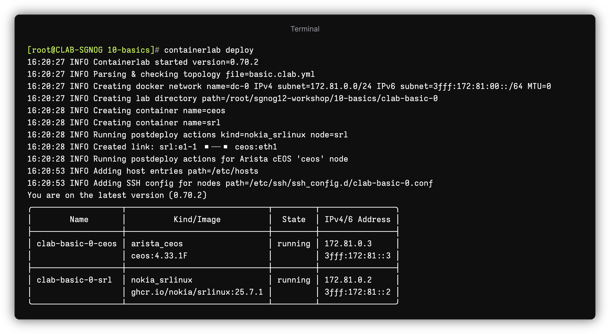

# Containerlab Basics

This workshop section introduces you to containerlab basics.

- Topology YAML file
- Image management workflow
- The lifecycle of a lab.

## Repository

The repo should be cloned already and you should navigate to the `sgnog12-workshop` directory if you are not there already.

```
[*]─[clab]─[~/sgnog12-workshop/10-basics]
└──>
```

## Topology

In Containerlab, the lab is defined via the 'topology file'. Which is a YAML file which defines the nodes and links in your desired topology.

The topology file `basic.clab.yml` defines the lab we are going to use in this basics exercise. It consists of the two nodes:

* Nokia SR Linux
* Arista cEOS

The nodes are interconnected with a single link over their respective `e1-1` and `eth1` interfaces.

```yaml
name: basic
topology:
  nodes:
    srl:
      kind: nokia_srlinux
      image: ghcr.io/nokia/srlinux:latest
    ceos:
      kind: arista_ceos
      image: ceos:4.33.1F

  links:
    - endpoints: [srl:e1-1, ceos:eth1]
```


## Deployment

Try to deploy the lab:

```bash
containerlab deploy -t basic.clab.yml
```

!!! tip
  If your topology file ends with the `.clab.yaml` or `.clab.yml` file extension **AND** is the only topology in your current directory, you don't need to specify the `-t` flag. Containerlab will search for local topologies when deploying.

Note, you can use a shorter version of the same command - `clab dep -t basic.clab.yml`.

The deployment should succeed, and you should see the following tabular output.



## Connecting to the nodes

Connect to the Nokia SR Linux node using the container name:

```bash
ssh clab-basic-${GROUP_ID}-srl
```

Connect to the cEOS node using its IP address (note, the IP might be different in your lab):

```bash
ssh admin@172.20.20.3
```

## Containerlab host automation

Containerlab automatically creates `/etc/hosts` entries for each deployed lab so that you can use the host hostname rather than IP address. Check the entries:

```bash
cat /etc/hosts
```
## Containerlab ssh config automation

There is also SSH configuration created at `/etc/ssh/ssh_config.d` as `clab-{lab name}.conf`. This means you don't have to enter username for the node with your `ssh` command. 

```bash
cat /etc/ssh/ssh_config.d/clab-basic-${GROUP_ID}.conf
```

The known hosts file for the node entry is also set to `/dev/null` for the lab nodes. This means on subsequent deployments you don't have to worry if the host keys change.


## Checking network connectivity

SR Linux and cEOS are started with their first ethernet interfaces connected. Confirm the connectivity between the nodes.

The nodes also come up with LLDP enabled, our goal is to verify that the basic network connectivity is working by inspecting

```bash
ssh clab-basic-${GROUP_ID}-srl
```

and checking the LLDP neighbors on ethernet-1/1 interface

```
show /system lldp neighbor interface ethernet-1/1
```

The expected output should be:

```
--{ running }--[  ]--
A:srl# show /system lldp neighbor interface ethernet-1/1
  +----------+----------+---------+---------+---------+---------+---------+
  |   Name   | Neighbor | Neighbo | Neighbo | Neighbo | Neighbo | Neighbo |
  |          |          |    r    |    r    | r First | r Last  | r Port  |
  |          |          | System  | Chassis | Message | Update  |         |
  |          |          |  Name   |   ID    |         |         |         |
  +==========+==========+=========+=========+=========+=========+=========+
  | ethernet | 00:1C:73 | ceos    | 00:1C:7 | 20      | 16      | Etherne |
  | -1/1     | :46:95:5 |         | 3:46:95 | hours   | seconds | t1      |
  |          | C        |         | :5C     | ago     | ago     |         |
  +----------+----------+---------+---------+---------+---------+---------+
```

## Listing running labs

When you are in the directory that contains the lab file, you can list the nodes of that lab simply by using the `inspect` command.


If the topology file is located in a different directory, you can specify the directory the topology file lives in, or if multiple topology files live in that directory, give the absolute path to the topology file:

```bash
[*]─[clab]─[/tmp]
└──> containerlab inspect -t ~/sgnog12-workshop/10-basics
```

You can also list all running labs regardless of where their topology files are located:


The output will contain all labs and their nodes.

Shortcuts:

* `clab ins` == `containerlab inspect`
* `clab ins -a` == `containerlab inspect --all`

## Lab directory

Lab directory stores the artifacts generated by containerlab that are related to the lab:

* tls certificates
* node artifacts (such as startup configs)
* inventory files
* topology export json file

To list the contents of the lab directory, run:

```
[*]─[clab]─[~/sgnog12-workshop/10-basics]
└──> tree -L 3 clab-basic/
```

## Destroying the lab

When you are done with the lab, you can destroy it. Containerlab can try and find the `*.clab.yml` file in the current directory and use it so that you don't have to type it out.  
Try it:

```bash
clab des --cleanup
```

Alternatively, you could specify the topology file explicitly:

```bash
clab des -t basic.clab.yml --cleanup
```

The `--cleanup` flag ensures that the lab directory gets removed as well.

You finished the basics lab exercise!
