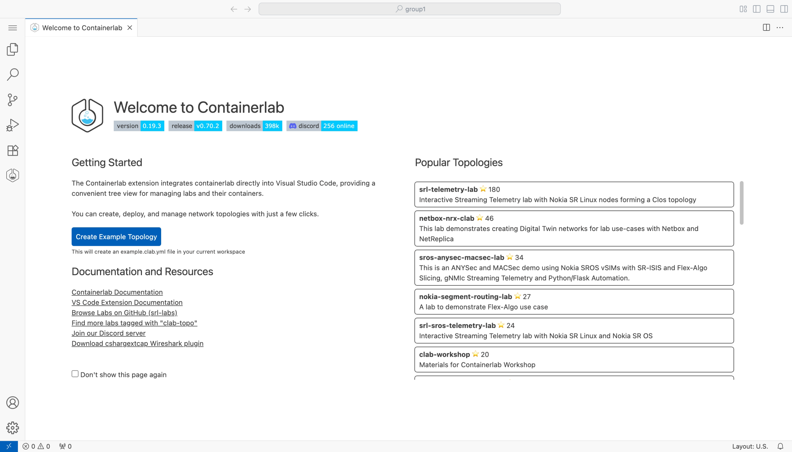
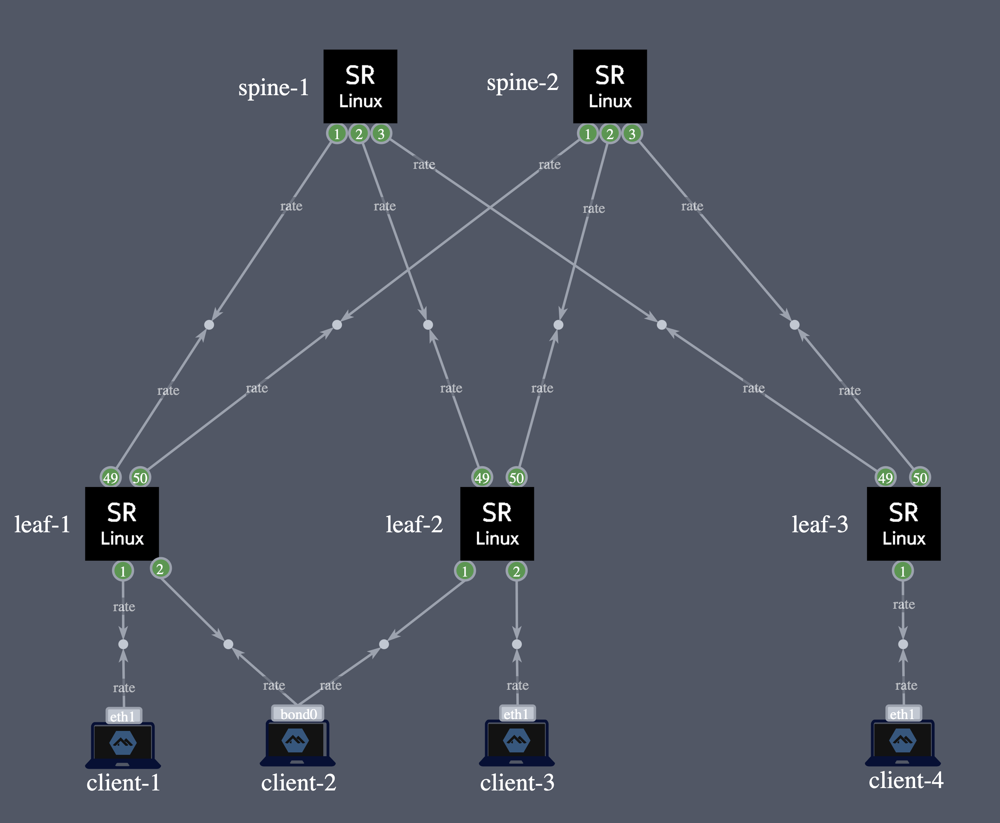

# Welcome to the Nokia workshop x SGNOG12!

This page is your starting point into the workshop, it should get you familiar with the lab environment provided by Nokia and provide an overview of the suggested sample activities.

During these 2 days you will work in groups on the pre-provided lab activities.

As long as you have a laptop with a web browser, you should be good to go. 

Need help, not a problem, pop your hand in the air and we will be there to guide you. 

## Pre-requisites

A list of workshop modules. Each module is a self-contained guide that can be followed independently, but it is recommended to go through them in order if you are new to Containerlab.


1. [Installing Containerlab](05-install/README.md)
2. [Containerlab basics](10-basics/README.md)
3. [Startup configuration](15-startup/README.md)
4. [VM-based nodes](20-vm/README.md)
5. [Container registries](30-registry/README.md)
6. [Packet capture](40-packet-capture/README.md)

Loved this workshop? Let us know in the comments of this [LinkedIn post](https://www.linkedin.com/posts/thomascorre_datacenter-netdevops-containerlab-activity-7376250483642052608-W_qm).

## Lab Environment

For this workshop each group of participants will receive their own dedicated directory running an instance of the lab topology.

If everything went according to plan, you should have received a physical piece of paper which contains:
- A group ID allocated to your group
- SSH credentials to a public cloud instance dedicated to your group. 
- HTTPS URL's towards this repo and access to a web based IDE in case you don't have one installed on your operating system.

!!! Warning
    Make sure to backup any code, config, ... ^^offline (e.g your laptop)^^.

    The public cloud instance will be destroyed once the workshop is concluded.

### Group ID

Please refer to the paper provided by the workshop session leaders. If nothing has been provided, not a problem, pop your hand in the air and an eager expert will be there to allocate one for you.

### VS Code (Recommended)

Each group has a web VS Code environment available, multiple users are available to connect to the web vscode session at the same time.

Navigate to `group<GROUP ID>.topologies.dev` and log in with your group password.



### SSH

- Hostname: **refer to the paper provided**
- Username: **refer to the paper provided or the slide presented**
- Password: **refer to the paper provided or the slide presented**

!!! tip
    To enable password-less access to an instance, use `ssh-keygen -h` to generate a public/private key pair and then `ssh-copy-id` to copy it to the server.

### WiFi

Details provided in the session.

#### Pre-provided activities

Below you can find a table with links towards those pre-provided project which you can use as a baseline for the problem/project you might want to tackle or perform the tasks we've set up for you.

The lab comes with a README of its own, please click the link below for more information.

| Link to pre-provided labs | NOS | Difficulty |
| --- | --- | --- |
| [DC lab](./dc-lab) | SR Linux | Intermediate |
| [EDA lab](./eda-lab) | EDA | Intermediate |

#### Topology

When accessing your group instance you'll see this repository has already been cloned for you and a fully configured network is up and running (powered by [containerlab](https://www.containerlab.dev)).

!!! question "Will I interfere with other groups?"
    Don't worry: This is your personal group network, you cannot impact any other groups.



The above topology contains a number of functional blocks to help you in area's you might want to focus on, it contains:

**IXP DC lab:**

- a CLOS model:
    - 2x spines (spine1|spine2) and 3 leaf switches (leaf1|leaf2|leaf3)
- IPv6 BGP unnumbered configured in the underlay
- Linux clients are attached to L2 EVPN service allowinga full mesh of traffic
- A streaming telemetry stack (gNMIc/prometheus/grafana)

### Help! I've bricked my lab, how do I redeploy? 

When accessing your workshop host, you'll see in your home directory: the SGNOG12 directory is a clone of this repository.

The labs covered in this workshops (powered by [containerlab](https://www.containerlab.dev)), are available for you to use.

If you have broken something and would like to restore the state without extensively troubleshooting, you can destroy and redeploy the command via following `clab` commands:

```sh
cd $HOME/
clab destroy -t sgnog12-workshop/dc-lab/dc.sgnog12.clab.yml --cleanup 
clab deploy -t sgnog12-workshop/dc-lab/dc.sgnog12.clab.yml --reconfigure
```

## Cloning this repository

If you would like to work locally on your personal device you should clone this repository. 

This can be done using one of the following commands below.

### HTTPS (Recommended)
```sh
git clone https://github.com/thcorre/sgnog12-workshop.git
```

### SSH
```sh
git clone git@github.com:thcorre/sgnog12-workshop.git
```

### GitHub CLI
```sh
gh repo clone thcorre/sgnog12-workshop
```

## Useful links

* [Nokia network developer portal](https://network.developer.nokia.com/)
* [containerlab](https://containerlab.dev/)
* [gNMIc](https://gnmic.openconfig.net/)
* [Learn Nokia SR Linux](https://learn.srlinux.dev/)
* [SR Linux YANG Browser](https://yang.srlinux.dev/)
* [gNxI Browser](https://gnxi.srlinux.dev/)
* [Nokia EDA](https://eda.dev/)

### Misc Tools/Software
#### Windows

* [Containerlab WSL](https://github.com/srl-labs/WSL-Containerlab?tab=readme-ov-file#quick-start)
* [Windows Terminal](https://apps.microsoft.com/store/detail/windows-terminal/9N0DX20HK701)
* [MobaXterm](https://mobaxterm.mobatek.net/download.html)
* [PuTTY Installer](https://the.earth.li/~sgtatham/putty/latest/w64/putty-64bit-0.78-installer.msi)
* [PuTTY Binary](https://the.earth.li/~sgtatham/putty/latest/w64/putty.exe)

#### MacOS

* [iTerm2](https://iterm2.com/downloads/stable/iTerm2-3_4_19.zip)
* [Warp](https://app.warp.dev/get_warp)
* [Hyper](https://hyper.is/)
* [Terminal](https://support.apple.com/en-gb/guide/terminal/apd5265185d-f365-44cb-8b09-71a064a42125/mac)

#### Linux

* [Gnome Console](https://apps.gnome.org/en/app/org.gnome.Console/)
* [Gnome Terminal](https://help.gnome.org/users/gnome-terminal/stable/)

#### Development tools

* [VS Code](https://code.visualstudio.com/Download)
    - [Containerlab extension](https://marketplace.visualstudio.com/items?itemName=srl-labs.vscode-containerlab)
    - [Nokia EDA extension](https://marketplace.visualstudio.com/items?itemName=eda-labs.vscode-eda)
* [VS Code Web](https://vscode.dev/)
* [Sublime Text](https://www.sublimetext.com/download)
* [IntelliJ IDEA](https://www.jetbrains.com/idea/download/)
* [Eclipse](https://www.eclipse.org/downloads/)
* [PyCharm](https://www.jetbrains.com/pycharm/download)
