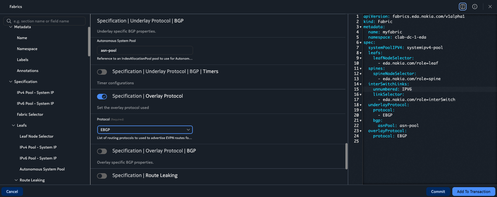

# 🏗️ Part 1: Fabric Intent Creation & Verification

> **EDA Fabric: Intent Creation & Status Verification**

This guide provides a **step-by-step workflow** to create a fabric intent for an CLOS leaf–spine IP underlay in **Nokia EDA** and verify the resulting fabric status and node configuration.

---

## 📋 Table of Contents

1. [Overview](#-overview)
2. [Prerequisites](#-prerequisites)
3. [Quick Summary](#-quick-summary)
4. [Step-by-Step Guide](#-step-by-step-guide)
   - [Step 1: Create the Fabric Intent](#step-1-create-the-fabric-intent)
   - [Step 2: Transaction Dry-Run & Review](#step-2-transaction-dry-run--review)
   - [Step 3: Commit the Intent](#step-3-commit-the-intent)
   - [Step 4: Check Fabric Health & Summary](#step-4-check-fabric-health--summary)
   - [Step 5: Drill Down - Leafs, Spines, Routers](#step-5-drill-down---leafs-spines-routers)
   - [Step 6: Verify on Devices (SR Linux)](#step-6-verify-on-devices-sr-linux)
5. [Troubleshooting & Tips](#-troubleshooting--tips)
6. [What's Next?](#-whats-next)

---

## 🎯 Overview

In this lab, you will:

- ✅ Create a fabric intent to automate underlay configuration
- ✅ Use EDA's dry-run feature to preview changes safely
- ✅ Deploy the fabric intent across your leaf-spine topology
- ✅ Verify fabric health through EDA's GUI
- ✅ Validate configurations directly on SR Linux devices

**Estimated time:** 45 minutes

---

## ✅ Prerequisites

Before starting, ensure you have:

- ✔️ An operational **EDA environment** with GUI access
- ✔️ A discovered/imported topology (leafs/spines)
- ✔️ Pre-created **allocation pools**:
  - System IPs
  - Inter-switch /31 pools
  - ASN pool
- ✔️ **Labels** on nodes and links to distinguish:
  - Leaf nodes (`eda.nokia.com/role=leaf`)
  - Spine nodes (`eda.nokia.com/role=spine`)
  - Inter-switch links (`eda.nokia.com/role=interSwitch`)

> **Note:** This guide assumes pools and selectors already exist and references them by name in examples.

---

## 🚀 Quick Summary

| Step | Action |
|------|--------|
| **1** | Create a fabric intent in EDA with required parameters |
| **2** | Add to transaction and run **dry-run** to preview changes |
| **3** | Review summary: input CRs, changed CRs, intents run, nodes impacted |
| **4** | **Commit** the transaction to push configuration to nodes |
| **5** | Check fabric health & summary in GUI; drill down to entities |
| **6** | Verify on devices: interfaces, network-instance, routes, BGP neighbors |

---

## 📖 Step-by-Step Guide

### Step 1: Create the Fabric Intent

Navigate to **Fabrics → Create** in the EDA GUI and configure the following parameters:

| Parameter | Value |
|-----------|-------|
| **Name** | `myfabric` |
| **Namespace** | `clab-dc-${GROUP_ID}-eda` |
| **IPv4 Pool – System IP** | `systemipv4-pool` |
| **Leaf Node Selector** | `eda.nokia.com/role=leaf` |
| **Spine Node Selector** | `eda.nokia.com/role=spine` |
| **InterSwitchLinks Unnumbered** | `IPV6` |
| **Link Selector** | `eda.nokia.com/role=interSwitch` |
| **Underlay Protocol** | `EBGP` |
| **Underlay Protocol – Autonomous System Pool** | `asn-pool` |
| **Overlay Protocol** | `EBGP` |

See the below screenshot for reference:


> **What happens next?** When committed, EDA evaluates each topology node against the selectors (leaf/spine), allocates IPs and ASNs from the configured pools, and generates node configurations automatically.

---

### Step 2: Transaction Dry-Run & Review

After creating the fabric intent:

1. ➕ Add it to a **transaction**
2. ✍️ Add a **commit message**
3. 🔍 Click **Dry-run**

#### What is Dry-Run?

EDA executes the intent **without changing any node**, allowing you to validate everything safely. The summary displays:

- 📊 Intent runs
- 🔄 Changed CRs
- 🖥️ Nodes with changes

#### Explore the Details

| Column | What to Inspect |
|--------|----------------|
| **Input CRs** | Configuration resources being provided |
| **Changed CRs** | EDA building blocks: interfaces, routers, BGP groups/peers, policies |
| **Intents Run** | Which intents were executed |
| **Nodes with changes** | Affected devices |

#### View Configuration Diffs

Use the **Diff view** to compare per-node configuration before/after:

- Example: A leaf may gain `subinterface 0` with a `/31` address on an inter-switch link, allocated from your subnet pool

> ⚠️ **Important:** Dry-run makes **no changes**. A device (e.g., `leaf3`) will still show only its pre-existing config until you commit.

---

### Step 3: Commit the Intent

1. Return to the **transaction basket**
2. Click **Commit**

EDA will push all resulting configuration changes to the nodes.

✅ The transaction will show **"Commit Successful"** when complete.

---

### Step 4: Check Fabric Health & Summary

Navigate to **Fabrics** and view the fabric status.

#### Health Score

EDA reports a **health score** (e.g., `100%`) computed from:

- 🔀 Routers (network-instances)
- 🔗 Links
- 🤝 BGP peers

#### Summary View

Switch to the **Summary view** to see:

- 📈 Graphical breakdown of fabric building blocks:
  - Default interfaces/routers
  - Inter-switch links
  - Default BGP peers
- 📊 Trend of learned routes across the fabric

---

### Step 5: Drill Down - Leafs, Spines, Routers

From the **Summary view**, explore the fabric components:

| Component | Action | What to Verify |
|-----------|--------|----------------|
| **Leafs** | Click **view** on Leafs | Node details including assigned underlay ASNs |
| **Spines** | Click **view** on Spines | Both spines share the ASN from `asn-pool` (e.g., `65000`) |
| **Default Routers** | Click **view** on Default Routers | Router health and parameters (e.g., `router-id` from system IP pool) |

---

### Step 6: Verify on Devices (SR Linux)

SSH to a spine (e.g., `spine1`) and verify the configuration.

#### 🔌 Interfaces

Check interfaces and `/31` addresses on routed subinterfaces:

```bash
show interface
```

**Expected output:**
- Routed subinterfaces: `ethernet-1/1.0`, `ethernet-1/2.0`, `ethernet-1/3.0`
- `/31` addresses from the inter-switch pool
- `system0.0` loopback with the system IP

---

#### 🌐 Network Instance

Inspect the default network-instance and BGP config:

```bash
info network-instance default
```

**Expected configuration:**
- Default network-instance with `router-id` (system IP)
- Routed interfaces added by the fabric intent
- BGP enabled with configured `autonomous-system` and eBGP defaults

---

#### 🗺️ Route Table

View routes in the default network-instance:

```bash
show network-instance default route-table
```

**Expected routes:**
- `/32` system routes for leaf/spine nodes
- `/31` connected interfaces
- Next-hops over the inter-switch links

---

#### 🤝 BGP Neighbors

Confirm BGP sessions to leafs (IPv4-unicast + EVPN):

```bash
show network-instance default protocols bgp neighbor
```

**Expected neighbors:**
- eBGP neighbors to leafs
- Both `ipv4-unicast` (underlay) and `evpn` (overlay) AFI/SAFI
- Status: **Established**
- Matches the fabric intent (EBGP for both underlay and overlay)

---

## 🛠️ Troubleshooting & Tips

<details>
<summary><b>❓ Dry-run shows changes, but devices didn't update</b></summary>

**Answer:** This is **expected behavior**. Dry-run does not touch devices—it only previews changes.

**Solution:** Commit the transaction to push changes to devices.

</details>

<details>
<summary><b>❓ Unexpected node count in Summary</b></summary>

**Issue:** The fabric shows fewer nodes than your topology (e.g., 3 leafs visible when topology has 4).

**Solution:** Use the Summary drill-downs to investigate:
- Label/selector coverage
- Intent scope
- Node discovery status

</details>

<details>
<summary><b>❓ How to validate diffs per node?</b></summary>

**Solution:** Use the **Diff view** to confirm exactly what EDA intends to configure:
- Interfaces
- BGP groups/peers
- Policies

</details>

<details>
<summary><b>❓ BGP sessions not establishing</b></summary>

**Possible causes:**
- IP address allocation errors
- ASN mismatches
- Interface not operationally up

**Solution:**
1. Verify interface status: `show interface brief`
2. Check BGP configuration: `info network-instance default protocols bgp`
3. Review EDA transaction logs for errors

</details>

---

## 🎓 What's Next?

Congratulations! You've successfully created and verified your fabric underlay using EDA intents.

**Next steps:**

- 🔄 **[Part 2: Service Overlays](part2-service-overlays.md)** - Build EVPN-VXLAN services on top of your fabric
- 🔍 **[Part 3: Deviations & EQL](part3-deviations-eql.md)** - Monitor and query your network state

---

## 📚 Additional Resources

- [Nokia EDA Documentation](https://network.developer.nokia.com/)
- [SR Linux Documentation](https://documentation.nokia.com/srlinux/)
- [Back to Main Lab Guide](README.md)

---

**Ready for Part 2?** 🎯 Continue to [Service Overlays](part2-service-overlays.md)
